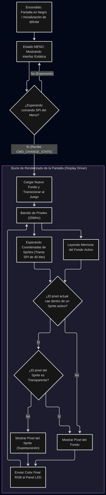

# Diagrama de Flujo del Display Driver

El siguiente diagrama describe el flujo de la pantalla desde su encendido, pasando por la gestión del menú, hasta el bucle de renderizado en tiempo real donde se realiza la multiplexación entre fondos y sprites.

